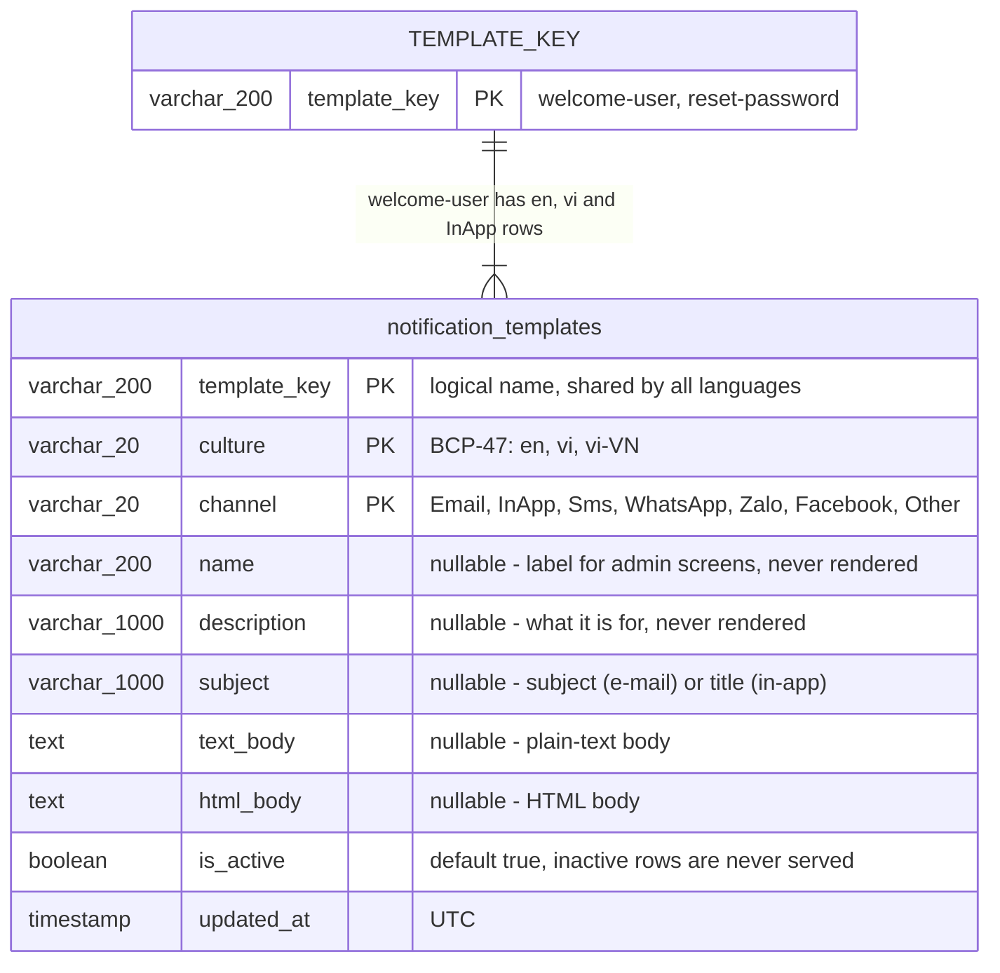

# Templar reference

The detail behind [the README](../README.md): every option, the data model, caching semantics and the
sample application's API.

## The three services

`AddTemplar()` registers three interfaces so a caller depends only on what it does.

| Service | Members |
| --- | --- |
| `ITemplateRenderService` | `RenderAsync`, `TryRenderAsync` — resolve a variant and substitute values |
| `ITemplateQueryService` | `ListAsync`, `ListKeysAsync`, `GetVariantsAsync`, `FindAsync` (exact), `ResolveAsync` (with fallback) |
| `ITemplateCommandService` | `SaveAsync`, `DeleteAsync`, `InvalidateAsync` |

A fourth, `ITemplateChannelService`, is metadata rather than data: `GetAll()` returns every
`TemplateChannel` as a `TemplateChannelInfo(int Value, string Label)`, ordered by value, so an admin
screen can fill a channel picker without hard-coding the enum — and a channel added to the enum
appears there on its own. It reads neither store nor cache, so it is a singleton and works even
before a database provider is attached.

```csharp
// [{ "value": 0, "label": "Email" }, { "value": 1, "label": "InApp" }, … ]
IReadOnlyList<TemplateChannelInfo> channels = channelService.GetAll();
```

`Label` is exactly what the `channel` column stores, so it round-trips back to
`Enum.Parse<TemplateChannel>(label)`.

`RenderAsync` throws `TemplateNotFoundException` when nothing matches; `TryRenderAsync` returns
`null`.

`FindAsync` matches the exact culture and returns inactive rows, which is what an editing screen
needs; `ResolveAsync` applies fallback and skips inactive rows, which is what a render needs.

## Managing templates (CRUD)

Commands write, queries read. There is no separate "create" and "update" — `SaveAsync` is keyed by
(key, culture, channel) — and every command drops the affected key from the read cache, which is the
step that is easy to forget when writing to `ITemplateWriteStore` directly.

```csharp
using Templar;
using Templar.Abstractions;

public sealed class TemplateAdmin(ITemplateCommandService commands, ITemplateQueryService queries)
{
    // CREATE / UPDATE — one template, or a whole set of languages at once
    public Task SaveAsync(TemplateDefinition template, CancellationToken ct)
        => commands.SaveAsync(template, ct);

    public Task SaveAllAsync(IEnumerable<TemplateDefinition> templates, CancellationToken ct)
        => commands.SaveAsync(templates, ct);

    // READ — everything, every key, every variant of one key, or one exact variant
    public Task<IReadOnlyList<TemplateDefinition>> ListAsync(CancellationToken ct)
        => queries.ListAsync(ct);

    public Task<IReadOnlyList<string>> ListKeysAsync(CancellationToken ct)
        => queries.ListKeysAsync(ct);

    public Task<IReadOnlyList<TemplateDefinition>> GetAsync(string key, CancellationToken ct)
        => queries.GetVariantsAsync(key, ct);

    public Task<TemplateDefinition?> GetAsync(string key, string culture, TemplateChannel channel, CancellationToken ct)
        => queries.FindAsync(key, culture, channel, ct);

    // DELETE — one variant
    public Task<bool> DeleteAsync(string key, string culture, TemplateChannel channel, CancellationToken ct)
        => commands.DeleteAsync(key, culture, channel, ct);
}
```

`TemplateDefinition` is a record, so adding a language or editing a variant is a `with` away:

```csharp
var vietnamese = new TemplateDefinition
{
    TemplateKey  = "welcome-user",
    Culture      = "vi",
    Channel      = TemplateChannel.Email,
    Name         = "Email chào mừng",                  // metadata for admin screens, never rendered
    Description  = "Gửi sau khi người dùng xác nhận email.",
    Subject      = "Chào mừng tới XXX",
    TextBody     = "Xin chào {{username}}, đây là email của bạn {{EMAIL}}",
    HtmlBody     = "<p>Xin chào <strong>{{username}}</strong></p>",
    UpdatedAtUtc = DateTimeOffset.UtcNow,
};

var english = vietnamese with { Culture = "en", Subject = "Welcome to XXX", Name = "Welcome e-mail" };
var edited  = english with { Subject = "Welcome!", UpdatedAtUtc = DateTimeOffset.UtcNow };
```

`ITemplateSchemaInitializer.EnsureSchemaAsync()` creates the table or index if it is missing — handy
for tests and small deployments; production schemas usually come from real migrations.

## Values and formatting

```csharp
var values = TemplateValues.Create()
    .Set("username", "Nguyễn")                                   // HTML-encoded in an HTML body
    .Set("AMOUNT", 1234.5m)                                      // "1.234,5" for vi, "1,234.5" for en
    .Set("EXPIRES_AT", DateTimeOffset.UtcNow.AddMinutes(15))
    .Set("CTA", TemplateRaw.Html("<a href=\"/go\">Confirm</a>")); // trusted markup, not encoded
```

Values substituted into an HTML body are HTML-encoded (`<script>` arrives as `&lt;script&gt;`) while
non-ASCII letters stay intact, so Vietnamese text remains readable. Text bodies and subjects are
never encoded. Numbers and dates format in the *template's* culture, not the request's.

`TemplateValues.FromObject(new { … })` builds the same thing from an anonymous object. Placeholder
names match case-insensitively and ignore `_`, `-`, `.` and space, so one value named `username`
satisfies `{{username}}`, `{{UserName}}` and `{{USER_NAME}}`. Pass `StringComparer.Ordinal` to
`TemplateValues.Create(…)` when exact matching is required.

## Dynamic templates: the Scriban engine

The engine is [Scriban](https://github.com/scriban/scriban), and `AddTemplar()` registers it. A body
can hold a table of order lines or a paragraph only VIP customers see with nothing extra installed
and nothing extra called:

```csharp
services.AddTemplar()
        .UsePostgreSql(connectionString);  // Scriban is already the engine
```

It ships inside `Templar.Core` — there is no separate package. Everything else in this document
applies unchanged: culture fallback, caching, the three services, `Parts`, `TemplateRaw`,
`MissingVariableBehavior`. The engine's own settings live on the same `TemplateOptions`, so
`AddTemplar(options => …)` tunes it — there is no second call to make.

```
Subject:  Order {{ order.reference }} confirmed

{{~ if customer.is_vip ~}}
<p>As a VIP member your delivery is free.</p>
{{~ end ~}}
{{~ case order.status ~}}
{{~ when 'paid' ~}}
<p>Payment received — we are packing your order.</p>
{{~ when 'pending' ~}}
<p>We are still waiting for your payment.</p>
{{~ else ~}}
<p>Order status: {{ order.status }}</p>
{{~ end ~}}
<table>
  {{~ for line in order.lines ~}}
  <tr style="background: {{ if for.even }}#fff{{ else }}#f6f6f6{{ end }}">
    <td>{{ line.name }}</td>
    <td>{{ line.quantity }}</td>
    <td>{{ line.total | format 'N0' }}</td>
  </tr>
  {{~ else ~}}
  <tr><td colspan="3">This order has no lines.</td></tr>
  {{~ end ~}}
</table>
<p>Placed on {{ order.placed_at | format 'D' }}.</p>
```

`~}}` swallows the newline that follows a tag and `{{~` the spaces that precede one, which is what
keeps generated HTML from filling with blank lines. `for` exposes `for.index`, `for.first`,
`for.last`, `for.even` and `for.odd`, and takes an `else` branch for an empty collection.
`case`/`when` is the switch: each `when` takes one value or a comma-separated list, and `else` is the
default arm. Scriban's own
[builtins](https://github.com/scriban/scriban/blob/master/doc/builtins.md) — `string`, `math`,
`date`, `array`, `object`, `regex` — are all available: `{{ line.name | string.truncate 40 }}`.

Pass nested data as ordinary objects, dictionaries or lists:

```csharp
var values = TemplateValues.Create()
    .Set("customer", new { FirstName = "Huy", IsVip = true })
    .Set("order", new { Reference = "XXX-1042", Total = 2_650_000m, PlacedAt = DateTimeOffset.UtcNow, Lines = lines });
```

### Coming from Templar 1.0

1.0 shipped a placeholder-only engine instead, and it was removed in 2.0. Bodies written for it carry
over unchanged except in two places:

| Behaviour | Under Scriban |
| --- | --- |
| `{{ username }}` | Same. Top-level names still match through `TemplateVariableNameComparer` |
| `{{ user.FirstName }}` | Works, as do `first_name` and `firstname` (`MemberNameFallback`) |
| HTML encoding | Same. Only `{{ … }}` output is encoded, never the template's own markup |
| `TemplateRaw.Html(…)` | Same, plus `{{ value \| raw }}` from inside the template |
| Culture | Same — `{{ amount }}` and `format` use the *template's* culture |
| `MissingVariableBehavior` | All three modes, and every missing name is still reported in one error |
| **`{{DATE:dd/MM/yyyy}}`** | **Rejected at compile time.** Write `{{ DATE \| format 'dd/MM/yyyy' }}` |
| **Text that looks like a placeholder** | **Now a syntax error.** 1.0 left it as literal text |

The format specifier is the one migration step that matters. Scriban does not treat
`{{DATE:dd/MM/yyyy}}` as an error — it renders it as an *empty string* — so Templar rejects the shape
itself with a `TemplateCompilationException` naming the replacement, rather than letting a carried-over
table lose values silently. `format` takes a .NET format string and applies the template's culture, so
it is a direct swap for the old syntax. `RejectLegacyFormatSyntax = false` turns the check off once the
rows are rewritten and you would rather not pay for the scan.

Single braces are safe: CSS (`body { color: red }`) and JSON (`{ "a": 1 }`) pass through untouched.
A literal `{{` is written `{{ '{{' }}`. Anything else that only *looks* like a placeholder is now a
`TemplateCompilationException` rather than literal text, so an editor that saves a body should compile
it before storing it.

### Engine options

The engine's settings are on `TemplateOptions` with everything else, so one `AddTemplar(options => …)`
configures both:

| Option | Default | Effect |
| --- | --- | --- |
| `LoopLimit` | 1000 | Maximum iterations per `for`/`while`. Templates come from a database, so this is what stops one bad row hanging a request thread |
| `RecursiveLimit` | 100 | Maximum nesting depth for template functions |
| `RegexTimeout` | 1 s | Timeout for the `regex` builtins |
| `RelaxedMemberAccess` | `true` | `{{ user.middle_name }}` yields nothing rather than failing — what makes `{{ if user.middle_name }}` writable |
| `MemberNameFallback` | `true` | Match member names with `TemplateVariableNameComparer` when the exact name misses |
| `RejectLegacyFormatSyntax` | `true` | Reject `{{DATE:dd/MM/yyyy}}` instead of rendering it empty |
| `UseLiquidSyntax` | `false` | Parse as Liquid (``) for bodies migrated from Shopify or Jekyll |
| `Functions` | empty | Named delegates the templates can call — see [Custom functions](#custom-functions) |
| `ConfigureContext` | — | `Action<TemplateContext>` run before each render, for anything `Functions` cannot express: a whole namespace of functions, or a `TemplateLoader` for `{{ include }}` |

Bad values are rejected at construction, like the rest of `TemplateOptions`: a non-positive
`LoopLimit` and a blank or null entry in `Functions` both fail the first time the engine is resolved
rather than on a later render.

### Custom functions

`Functions` is a name → delegate map, filled where the container is configured. Every stored body can
then call what it holds:

```csharp
services.AddTemplar(options =>
        {
            options.Functions["vnd"]  = (decimal amount) => $"{amount:N0} ₫";
            options.Functions["mask"] = (string card) => $"**** {card[^4..]}";
        })
        .UsePostgreSql(connectionString);
```

```
Paid {{ order.total | vnd }} with {{ mask card }}.
```

Either call style works — `{{ vnd total }}` and `{{ total | vnd }}` are the same call. Any delegate
shape is accepted: Scriban binds the template's arguments to the parameters and converts them, so a
`Func<decimal, string>` receives a number from the template rather than a string.

Four things worth knowing:

- **Names match like every other name.** `TemplateVariableNameComparer` applies, so `vnd` registered
  here also answers to `{{ VND … }}`, and `shortDate` to `{{ short_date … }}`.
- **They run in the template's culture.** The renderer sets the ambient culture for the duration of a
  render, so the single `vnd` above yields `1.250.000 ₫` for a `vi` row and `1,250,000 ₫` for an `en`
  one. Without that, `$"{amount:N0}"` would silently follow the server's locale instead.
- **A value shadows a function.** The values are pushed above the functions, so a value named `vnd`
  wins. Conversely a function *can* replace one of Templar's builtins — registering `format` overrides
  it.
- **They are shared.** One delegate serves every render on every thread, so it must not close over
  per-request state; pass that in as an argument. A blank name or a null delegate fails when the
  engine is first resolved, not at the first render.

Return `TemplateRaw.Html(…)` from a function to opt its output out of HTML encoding, exactly as a
value would; anything else it returns is encoded in an HTML body.

Two things `MissingVariableBehavior` does *not* reach: a missing **member** is governed by
`RelaxedMemberAccess`, not by it; and under `Keep` a missing name becomes the literal string
`{{name}}`, which is truthy — so `{{ if absent }}` takes the true branch in that mode.

### Replacing the engine

`ITemplateCompiler` and `ITemplateRenderer` are public, and `AddTemplar()` registers the Scriban pair
with `TryAdd`, so a different engine is `RemoveAll` on both followed by your own singletons. They come
as a pair on purpose: a compiler returns its own `CompiledTemplate` subclass and a renderer that is
handed another engine's throws a `TemplateRenderException` naming both types rather than guessing.

Templates come from a database, so an engine you write is also what decides how much a stored row can
do — `LoopLimit`, `RecursiveLimit` and `RegexTimeout` are the equivalent guards on the Scriban one.

## Channels and parts

One key holds one row per language **×** channel.

| Channel | Typical shape |
| --- | --- |
| `TemplateChannel.Email` | Subject plus a text and/or HTML body |
| `TemplateChannel.InApp` | Title plus a short body |
| `TemplateChannel.Sms` | A short plain-text body; no subject, no HTML |
| `TemplateChannel.WhatsApp` | A WhatsApp message |
| `TemplateChannel.Zalo` | A Zalo message |
| `TemplateChannel.Facebook` | A Facebook message — Messenger or a page notification |
| `TemplateChannel.Other` | Anything else — push payload, webhook body, PDF fragment |

Templar renders every one of them the same way and delivers none of them: sending is yours. `Other`
is deliberately the last member, so a channel added later slots in before it and the "none of the
above" bucket stays at the end.

`Parts` skips rendering work you do not need:

```csharp
var sms = await templates.RenderAsync(new TemplateRenderRequest
{
    TemplateKey = "reset-password",
    Culture     = "vi",
    Channel     = TemplateChannel.Sms,
    Values      = values,
    Parts       = TemplateParts.Text,
});
```

## Options

Everything `AddTemplar(options => …)` sets, in one place. The engine's own settings —
`LoopLimit`, `Functions`, `RelaxedMemberAccess` and the rest — are on the same object and are
tabulated under [Engine options](#engine-options).

| Option | Default | Effect |
| --- | --- | --- |
| `DefaultCulture` | `en` | Used when a request omits a culture; ends the fallback chain |
| `EnableCultureFallback` | `true` | `vi-VN` → `vi` → default; off means exact match only |
| `EnableCache` | `true` | Cache templates read from the database |
| `CacheDuration` | 5 min | Lifetime of a cached template set |
| `CacheKeyPrefix` | `templar:` | Key prefix for the distributed cache; ignored in process |
| `MissingVariableBehavior` | `Throw` | Or `Empty` (blank it) / `Keep` (leave `{{name}}` in place) |
| `HtmlEncodeValues` | `true` | Encode substituted values in HTML bodies |
| `CompiledTemplateCacheSize` | 1024 | Parsed templates kept in memory |

`MissingVariableBehavior` can be overridden per request.

## Service lifetimes

Anything that touches the database is **scoped**, the lifetime a connection expects; the cache and the
rendering engine are **singletons**.

| Registration | Lifetime |
| --- | --- |
| `ITemplateQueryService`, `ITemplateCommandService`, `ITemplateRenderService` | Scoped |
| `ITemplateStore`, `ITemplateWriteStore`, `ITemplateSchemaInitializer` | Scoped |
| `ITemplateCache` | Singleton — a per-request cache would not be a cache |
| `ITemplateCompiler`, `ITemplateRenderer` | Singleton — stateless apart from their own caches |
| `ITemplateChannelService` | Singleton — a fixed list read off the enum |
| `IMongoCollection<MongoTemplateDocument>` | Singleton — `MongoClient` owns the connection pool |
| `InMemoryTemplateStore` | Singleton — it *is* the data, so a scoped one would start empty |

Inside a request this is automatic. Outside one — startup seeding, a background service, a console
app — create a scope first:

```csharp
await using var scope = app.Services.CreateAsyncScope();
await scope.ServiceProvider.GetRequiredService<ITemplateCommandService>().SaveAsync(templates);
```

## Caching

By default templates are cached in process for `CacheDuration`, one entry per template key, and
commands evict the key they wrote. To share one copy between instances, register any
`IDistributedCache` and add `UseDistributedCache()`:

```csharp
builder.Services.AddStackExchangeRedisCache(o => o.Configuration = "localhost:6379");

builder.Services
    .AddTemplar(o => o.CacheKeyPrefix = "myapp:templates:")   // several apps, one Redis
    .UsePostgreSql(connectionString)
    .UseDistributedCache();
```

Entries are JSON. `IDistributedCache` cannot delete by pattern, so `InvalidateAsync(key)` removes
that key exactly, while `InvalidateAsync()` bumps a shared generation counter that makes every
existing key unreachable — other instances pick that up within two seconds. Set `EnableCache = false`
to turn caching off entirely while authoring templates.

A cache that cannot be reached never propagates the failure: it is logged as a warning and bypassed.
A read falls through to the store, and a failed eviction or clear leaves the stale entry alone rather
than failing the save that triggered it — so after a cache outage a template can be served from a
stale entry until `CacheDuration` expires it. The warning names the key this happened to, which is
what to watch for if you need writes to be visible everywhere immediately.

## Data model

The natural key is `(template_key, culture, channel)`. Every row for a key is fetched in one query
and cached; the language is then chosen in memory.



Per-engine column types, all created by `EnsureSchemaAsync()`:

| Column | MySQL | SQL Server | PostgreSQL | Oracle |
| --- | --- | --- | --- | --- |
| `template_key` / `name` | `VARCHAR(200)` | `NVARCHAR(200)` | `varchar(200)` | `VARCHAR2(200 CHAR)` |
| `culture`, `channel` | `VARCHAR(20)` | `NVARCHAR(20)` | `varchar(20)` | `VARCHAR2(20 CHAR)` |
| `description`, `subject` | `VARCHAR(1000)` | `NVARCHAR(1000)` | `text` | `VARCHAR2(1000 CHAR)` |
| `text_body`, `html_body` | `LONGTEXT` | `NVARCHAR(MAX)` | `text` | `CLOB` |
| `is_active` | `TINYINT(1)` | `BIT` | `boolean` | `NUMBER(1)` |
| `updated_at` | `DATETIME(6)` | `DATETIME2(3)` | `timestamptz` | `TIMESTAMP(3)` |

MongoDB stores the same fields camelCased, with the three key parts inside a composite `_id`.

### Primary key

`(template_key, culture, channel)` is the primary key itself, not just a unique constraint, and there
is no surrogate id column. The triple *is* the row's identity: one logical template, in one language,
for one channel.

| Engine | How `EnsureSchemaAsync()` declares it |
| --- | --- |
| MySQL | `PRIMARY KEY (template_key, culture, channel)` |
| PostgreSQL | `PRIMARY KEY (template_key, culture, channel)` |
| SQL Server | `CONSTRAINT PK_<table> PRIMARY KEY CLUSTERED (template_key, culture, channel)` |
| Oracle | `CONSTRAINT PK_<table> PRIMARY KEY (template_key, culture, channel)` |
| MongoDB | `_id` is a document — `{ templateKey, culture, channel }` — so uniqueness comes free |

Three things follow from it:

- **Writes are upserts.** The same triple is every dialect's conflict target: `ON DUPLICATE KEY
  UPDATE` (MySQL), `MERGE … WITH (HOLDLOCK)` (SQL Server), `ON CONFLICT … DO UPDATE` (PostgreSQL),
  `MERGE` (Oracle), `_id` replace (MongoDB). `SaveAsync` therefore has no separate create and update:
  saving `welcome-user` / `vi` / `Email` twice edits one row rather than adding a second.
- **Reads use its index.** `template_key` leads the key, so `SELECT … WHERE template_key = @key` —
  the one query behind every render — is served by the primary key index with no extra index to
  maintain. MongoDB cannot do that (`_id` is a whole document), which is why `EnsureSchemaAsync()`
  creates `ix_template_key` there and nowhere else.
- **The constraint name follows `TableName`.** SQL Server and Oracle name it `PK_<TableName>`, so
  pointing the store at `email_templates` produces `PK_email_templates` — upper-cased on Oracle,
  like every other identifier, unless `PreserveIdentifierCase` is set.

Case sensitivity of the key columns is the database's, not the library's: MySQL's
`utf8mb4_unicode_ci` matches keys case-insensitively, MongoDB compares byte-wise. Culture matching is
case-insensitive everywhere regardless, because it happens in `TemplateQueryService` rather than in
the store.

### Table name and schema

The table is called `notification_templates` by default. Point the library at your own name:

```csharp
.UsePostgreSql(connectionString, o =>
{
    o.TableName = "email_templates";
    o.Schema    = "notify";              // null leaves the table unqualified
    o.CommandTimeoutSeconds = 30;
})

.UseMongo(connectionString, o => { o.DatabaseName = "notifications"; o.CollectionName = "email_templates"; })
```

Renaming does not migrate anything — the new table is created empty, and an existing table needs the
columns above.

## Sample applications

There is one sample per provider, plus one for each cache. **Each is a single self-contained
`Program.cs` and shares no code with the others** — configuration, registration, seeding, the API and
the seed data are all in that one file, in that order, so you can read it start to finish and copy
the one you need without untangling anything. The files are near-identical on purpose; the provider
differences are the `Use…` call and the comment above it.

Each seeds the same three keys and, where the store supports it, creates its own table on startup:
`welcome-user` and `reset-password` (`en`/`vi`, e-mail and in-app, plus an SMS on the `Other` channel)
are the flat ones, and `order-confirmation` is the one that exercises the engine — a `for` over the
order lines as a table, `if`/`else` on VIP status, `case`/`when` on the order status, and the `vnd`
function each sample registers in its `AddTemplar` call.

| Project | Shows | Port |
| --- | --- | --- |
| `Templar.Sample.InMemory` | `UseInMemoryStore()` — needs no database | 5000 |
| `Templar.Sample.MemoryCache` | The default `MemoryTemplateCache`, with a store-read counter | 5001 |
| `Templar.Sample.DistributedCache` | `UseDistributedCache()` over Redis or memory | 5002 |
| `Templar.Sample.PostgreSql` | PostgreSQL | 5010 |
| `Templar.Sample.MySql` | MySQL / MariaDB | 5011 |
| `Templar.Sample.SqlServer` | SQL Server / Azure SQL | 5012 |
| `Templar.Sample.Oracle` | Oracle Database | 5013 |
| `Templar.Sample.Mongo` | MongoDB | 5014 |

```bash
make samples                                          # the list above
make run                                              # InMemory, http://localhost:5000/swagger
make up SAMPLE=PostgreSql && make run SAMPLE=PostgreSql
dotnet run --project samples/Templar.Sample.Mongo     # the underlying command
```

The whole of a sample's registration is this:

```csharp
var builder = WebApplication.CreateBuilder(args);
var settings = builder.Configuration.GetSection("Templates");

builder.Services.AddOpenApi();
builder.Services
    .AddTemplar(options =>
    {
        options.DefaultCulture = settings["DefaultCulture"] ?? "en";
        options.Functions["vnd"] = (decimal amount) => $"{amount:N0} ₫";
    })
    .UsePostgreSql(settings["ConnectionString"]!, store => store.Schema = settings["Schema"]);
```

### Swagger

`AddOpenApi()` produces the document at `/openapi/v1.json`; `Swashbuckle.AspNetCore.SwaggerUI` puts
Swagger UI in front of it at `/swagger`, and `/` redirects there. Endpoints carry `WithTags` and
`WithSummary`, so the page groups them under **Templates**, **Render** and **Cache** and explains each
one. Everything below is callable from that page — there is no separate UI.

| Method | Route | Purpose |
| --- | --- | --- |
| `GET` | `/` | Redirects to `/swagger` |
| `GET` | `/api/templates` | Every stored template, including inactive rows |
| `GET` | `/api/keys` | Just the template keys |
| `GET` | `/api/channels` | Every channel as `{ value, label }` |
| `GET` | `/api/templates/{key}` | Every language and channel of a key |
| `GET` | `/api/templates/{key}/{culture}?channel=` | One exact variant |
| `GET` | `/api/resolve/{key}?culture=&channel=` | Which variant fallback picks, unrendered |
| `POST` | `/api/templates` | Create |
| `PUT` | `/api/templates/{key}/{culture}?channel=` | Update one variant |
| `DELETE` | `/api/templates/{key}/{culture}?channel=` | Delete |
| `POST` | `/api/render` | Render subject, text and HTML |
| `POST` | `/api/render/html` | The same render as `text/html`, for looking at in a browser |
| `POST` | `/api/cache/clear?key=` | `InvalidateAsync` — omit `key` to clear every key |
| `GET` | `/api/cache/stats` | Store reads so far. **Cache samples only** |

`values` in a render body is free-form JSON, and its types are used as they arrive:

```json
{ "templateKey": "reset-password", "culture": "en",
  "values": { "username": "Huy", "CODE": "007193", "MINUTES": 15,
              "EXPIRES_AT": "2026-08-01T09:30:00Z" } }
```

`15` stays a number and formats per culture in `{{ MINUTES | format 'N0' }}`, the ISO string becomes a
`DateTimeOffset` for `{{ EXPIRES_AT | format 'g' }}`, and `"007193"` stays a string so a verification
code keeps its leading zero. JSON arrays and objects arrive as lists and dictionaries, which is what
lets `{{ for line in order.lines }}` iterate them.

```bash
J="content-type: application/json"

curl -s localhost:5000/api/templates -H "$J" -d '{
  "templateKey": "invoice-paid", "culture": "vi", "channel": "Email",
  "name": "Email hoá đơn", "description": "Gửi khi thanh toán thành công.",
  "subject": "Hoá đơn {{invoiceNo}} đã thanh toán",
  "textBody": "Xin chào {{username}}, hoá đơn {{invoiceNo}} ({{ AMOUNT | format 'N0' }} đ) đã thanh toán." }'

curl -s localhost:5000/api/render -H "$J" -d '{ "templateKey": "invoice-paid", "culture": "vi",
  "values": { "username": "Huy", "invoiceNo": "INV-204", "AMOUNT": 1990000 } }'
# → "Xin chào Huy, hoá đơn INV-204 (1.990.000 đ) đã thanh toán."

curl -s -X PUT 'localhost:5000/api/templates/invoice-paid/vi' -H "$J" \
     -d '{ "subject": "Đã nhận thanh toán", "textBody": "Cảm ơn {{username}}." }'
curl -s -X DELETE 'localhost:5000/api/templates/invoice-paid/vi'
```

A missing value returns `400` naming the placeholders; an unknown key or variant returns `404`.

### The two cache samples

Both wrap their store in a `CountingTemplateStore` — declared at the bottom of the same file — so
`GET /api/cache/stats` is a live cache-hit meter: render the same template twice and `storeReads` does
not move; save, delete or clear, and the next render is a miss.

`Templar.Sample.MemoryCache` is the default — `MemoryTemplateCache`, one entry per template key, at a
deliberately short 30 second `CacheSeconds` so expiry is watchable.

`Templar.Sample.DistributedCache` calls `UseDistributedCache()`. Without `Templates:Redis` it
registers `AddDistributedMemoryCache()`, which runs anywhere but is per-process. Point it at Redis and
two instances genuinely share one cache:

```bash
dotnet run --project samples/Templar.Sample.DistributedCache --Templates:Redis=localhost:6379 --urls http://localhost:5002
dotnet run --project samples/Templar.Sample.DistributedCache --Templates:Redis=localhost:6379 --urls http://localhost:5003
```

Render on 5003 and its `/api/cache/stats` goes to 1; render the same template on 5002 and its stays at
**0**, because it read the entry the other node wrote. Clear the cache on either and the other's next
read is a miss again within `DistributedTemplateCache.GenerationRefresh` (2 s) — that is the
generation counter in `{prefix}{generation}:{key}` doing its work.

The store in this sample is still per-process and in-memory, so it is the *cache* that is shared, not
the data: a template saved on one node is not readable from the other. Combine it with one of the
database samples for that.

### Backing services

`samples/docker-compose.yml` runs each database with the credentials, port and database name the
matching sample already has in its `appsettings.json`, so nothing needs configuring:

```bash
make up SAMPLE=PostgreSql        # just PostgreSQL
make up SAMPLE=all               # every engine plus Redis
make down                        # stop, keep the data
make down-clean                  # stop and delete the volumes
```

The compose profiles are the lowercased sample names, which is why `up` takes the same `SAMPLE=` as
`run`; `InMemory` and `MemoryCache` match no service, so `up` is a harmless no-op for them.

- Every host port is overridable when one is already taken:
  `TEMPLAR_REDIS_PORT=6399 make up SAMPLE=DistributedCache`. The variables are
  `TEMPLAR_{POSTGRES,MYSQL,SQLSERVER,ORACLE,MONGO,REDIS}_PORT`. Remember to point the sample at the
  new port too — `--Templates:ConnectionString=…`.
- SQL Server starts with no application database, so `make up SAMPLE=SqlServer` also runs a one-shot
  `sqlserver-init` container that creates `notifications`. Everything else creates its database from
  image environment variables.
- Oracle takes a few minutes on first start while it builds its data files; the healthcheck covers it,
  so `make up` simply waits. On Apple Silicon the SQL Server and Oracle images are amd64 and run
  emulated — slower, and Docker prints a platform warning.
- Each engine keeps a named volume, so data survives `make down`. Only `make down-clean` discards it.
- The samples create their own table on startup, so a scratch database with DDL permission is all any
  of them needs — which is also what the compose services provide.

### Configuration

Every sample reads the same `Templates` section, and has no `Provider` key — the project *is* the
choice of provider. A database sample's `appsettings.json` carries a placeholder connection string:

```json
"Templates": {
  "ConnectionString": "Host=localhost;Port=5432;Database=notifications;Username=postgres;Password=secret",
  "TableName": "notification_templates", "Schema": "public", "CommandTimeoutSeconds": 30,
  "DefaultCulture": "en", "EnableCultureFallback": true,
  "EnableCache": true, "CacheSeconds": 300,
  "SeedOnStartup": true
}
```

- `ConnectionStrings:Templates` is the fallback when `Templates:ConnectionString` is empty. A sample
  that finds neither fails at startup saying so.
- `Schema: ""` leaves the table unqualified; omitting the key keeps the provider default (`dbo`,
  `public`). MongoDB uses `Database` plus `TableName` as the collection name instead.
- `Oracle` additionally reads `PreserveIdentifierCase`; `DistributedCache` additionally reads `Redis`
  and `CacheKeyPrefix`.
- `SeedOnStartup: false` skips both `EnsureSchemaAsync` and the seed, leaving whatever is already
  stored.
- Everything is overridable on the command line:
  `dotnet run --Templates:TableName=email_templates --Templates:CacheSeconds=5`.
- Real credentials belong in user secrets or environment variables, not in this file.

## Tests

```bash
make test         # or: dotnet test Templar.slnx
```

115 unit tests cover the compiler, the renderer, the three services, culture fallback, channels, parts,
the in-process and distributed caches, the in-memory store, DI lifetimes, the Scriban engine (loops,
`if`/`else`, `case`/`when`, encoding, the three missing-value modes, the loop limit, the legacy-format
check and custom `Functions`) and the SQL each dialect generates — none need a database.

The five provider round-trip tests are skipped unless a connection string is exported. Each covers
DDL, both upsert paths, Unicode, a 12 KB body, UTC round-tripping, the `Other` channel, delete and a
render through the services. They create and drop their own `notification_templates_it` table, so a
scratch database with DDL permission is enough.

```bash
export TEMPLAR_POSTGRES="Host=localhost;Port=5432;Database=notifications;Username=postgres;Password=secret"
export TEMPLAR_MYSQL="Server=localhost;Port=3306;Database=notifications;User ID=root;Password=secret"
export TEMPLAR_SQLSERVER="Server=localhost,1433;Database=master;User ID=sa;Password=Secret_123;TrustServerCertificate=true"
export TEMPLAR_ORACLE="User Id=system;Password=secret;Data Source=localhost:1521/FREEPDB1"
export TEMPLAR_MONGO="mongodb://localhost:27017"

make test-all
```

## Project structure

```
src/Templar.Core          Abstractions/ (query, command, render + the 3 store contracts),
                          Services/ (their implementations), Rendering/ (the compiler and renderer
                          contracts, plus Scriban/ — the engine and its HTML-encoding context),
                          Caching/ (memory, distributed, null), Stores/ (in-memory),
                          and at the root the model (TemplateDefinition, TemplateValues, …)
                          plus registration (AddTemplar, UseDistributedCache, TemplarBuilder)
src/Templar.Relational    RelationalTemplateStore, shared by the four SQL providers
src/Templar.{MySql,SqlServer,PostgreSql,Oracle,Mongo}
                          one store + one Use… extension each
samples/Templar.Sample.{InMemory,MemoryCache,DistributedCache,PostgreSql,MySql,SqlServer,Oracle,Mongo}
                          four files each and no shared code: Program.cs (wiring, seeding, the API,
                          the request bodies and the seed data, in that order), a .csproj,
                          appsettings.json and Properties/launchSettings.json
samples/docker-compose.yml
                          each engine with the credentials its sample expects
tests/Templar.Tests       unit tests per area + opt-in provider round-trips
```

A SQL provider supplies only its connection object, identifier quoting, DDL and upsert statement;
everything else is inherited. Namespaces follow the folders, except that registration extensions
live in `Templar` so `AddTemplar().UseMySql(cs)` needs one `using` — injecting any of the three
services also needs `using Templar.Abstractions;`.

## Notes

- **Oracle identifiers** are upper-cased before quoting, matching conventional DDL. Set
  `PreserveIdentifierCase = true` for a table created with quoted lower-case names.
- **MongoDB matches template keys exactly** — byte-wise, without a collation. Culture matching stays
  case-insensitive because it happens in the query service.
- **`NU1902` / `NU1903` on restore** come from `SharpCompress` and `Snappier`, pulled in by
  `MongoDB.Driver` for optional wire compression. No released version clears the advisory, so they
  stay at the versions the driver ships with.
- **`TemplateCompilationException` on a body that used to render** — the engine is Scriban, so a body
  still written in Templar 1.0's `{{DATE:d}}` syntax is rejected rather than rendered empty. Write
  `{{ DATE | format 'd' }}`; see [Coming from Templar 1.0](#coming-from-templar-10).
